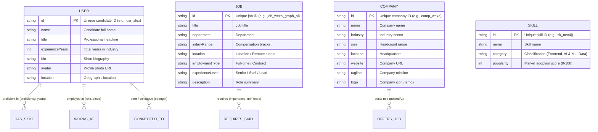

# 🕸️ Wexa AI — Graph-Powered Talent & Opportunity Recommendation Network

A full-stack, production-grade web application backed by **CognoDB Cloud** (openCypher over Bolt protocol via the official `neo4j-driver`). The application models complex interconnected relationships between **Candidates (Users)**, **Skills**, **Job Postings**, and **Companies** to solve real-world talent matching, multi-hop social referral discovery, and collaborative skill gap analysis.

---

## 📑 Table of Contents
1. [Architectural Overview](#-architectural-overview)
2. [Why a Graph Database? (Deep Dive)](#-why-a-graph-database)
3. [Graph Data Model & Ontology](#-graph-data-model--ontology)
4. [Key Multi-Hop Cypher Queries Explained](#-key-multi-hop-cypher-queries-explained)
5. [CognoDB Cloud Setup Guide](#-cognodb-cloud-setup-guide)
6. [Local Installation & Quickstart](#-local-installation--quickstart)
7. [Frontend Features & UI Design](#-frontend-features--ui-design)
8. [API Reference](#-api-reference)

---

## 🏛️ Architectural Overview

```
 ┌────────────────────────────────────────────────────────┐
 │                   React + Tailwind CSS                 │
 │              (Vite SPA, Interactive Canvas)            │
 └───────────────────────────┬────────────────────────────┘
                             │ HTTP / JSON REST APIs
                             ▼
 ┌────────────────────────────────────────────────────────┐
 │                   Node.js + Express                    │
 │               (Secure Parameterized API)               │
 └───────────────────────────┬────────────────────────────┘
                             │ Bolt Protocol (bolt+s://)
                             │ neo4j-driver (v5.x)
                             ▼
 ┌────────────────────────────────────────────────────────┐
 │                    CognoDB Cloud                       │
 │        (Native Graph Database Engine & openCypher)     │
 └────────────────────────────────────────────────────────┘
```

### Technology Stack
- **Data Layer:** [CognoDB Cloud](https://console.cognodb.com) (openCypher / Bolt 5.0–5.4 Protocol)
- **Database Driver:** Official `neo4j-driver` for JavaScript/Node.js
- **Backend API:** Node.js, Express, `cors`, `dotenv`
- **Frontend App:** React 18, Tailwind CSS, Lucide React, HTML5 Canvas Force-Directed Graph Engine, Vite

---

## 🧠 Why a Graph Database?

Relational SQL databases and flat document/NoSQL stores fall short when querying densely interconnected networks. Here is why a graph database like CognoDB is fundamentally superior for this use case:

```
Relational (SQL JOINs):       O(n^k) Exponential degradation as joins multiply
Graph (Index-Free Adjacency): O(k)   Constant-time pointer dereferences per hop
```

### 1. Index-Free Adjacency vs. Cartesian Join Explosion ($O(k)$ vs. $O(n^k)$)
- **In Relational Databases (RDBMS):** Connecting a candidate to matching jobs through their required skills, filtering for missing skills, and searching for 1st-degree employee referrals requires joining **6+ tables**: `users`, `user_skills`, `skills`, `job_skills`, `jobs`, `companies`, and a self-joining `user_connections` table.
  - Each `JOIN` executes B-Tree index lookups with time complexity $O(\log N)$ or table scans.
  - As dataset size $N$ grows into millions of rows, multi-hop queries experience combinatorial join explosions and heavy buffer cache thrashing.
- **In CognoDB (Graph Engine):** Nodes hold direct memory/storage pointers to adjacent relationships and nodes (**Index-Free Adjacency**).
  - Traversing from `User` $\to$ `HAS_SKILL` $\to$ `Skill` $\to$ `REQUIRES_SKILL` $\to$ `Job` takes time proportional **only to the number of edges attached to the node ($O(k)$)**, regardless of whether the database contains 1,000 nodes or 100,000,000 nodes.

### 2. Deep Multi-Hop Social Graph Traversal
In traditional SQL, recursive path lookups (e.g., *"Find all colleagues of this candidate who currently work at the hiring company offering the job"*) require recursive Common Table Expressions (`WITH RECURSIVE`), which are notoriously difficult to optimize and scale. In Cypher, it is an intuitive 2-hop pattern:
```cypher
MATCH (u:User {id: $userId})-[:CONNECTED_TO]->(peer:User)-[:WORKS_AT]->(c:Company)
```

### 3. Schema Agility & Semi-Structured Evolution
In a graph database, adding new relationship types (e.g., `(:User)-[:MENTORED]->(:User)` or `(:Skill)-[:SUB_CATEGORY_OF]->(:Skill)`) requires zero database migrations or altering foreign key constraints.

---

## 📊 Graph Data Model & Ontology



---

## 🔍 Key Multi-Hop Cypher Queries Explained

All Cypher queries in this application are strictly **parameterized** (preventing injection risks and enabling query plan caching in CognoDB).

### 1. Multi-Hop Job Recommendation & Social Referral Routing (2–3 Hops)
This query performs a simultaneous 2-hop skill match and a 2-hop social referral lookup in a single traversal:

```cypher
// 1. Traverse 2 hops from User to Job via shared Skill nodes, and 1 hop to Company
MATCH (u:User {id: $userId})-[hs:HAS_SKILL]->(s:Skill)<-[rs:REQUIRES_SKILL]-(j:Job)<-[:OFFERS_JOB]-(c:Company)

// 2. Traverse 2 hops to check if the candidate has 1st-degree connections working at that Company
OPTIONAL MATCH (u)-[:CONNECTED_TO]->(peer:User)-[:WORKS_AT]->(c)

// 3. Aggregate matched skills and internal referrals
WITH u, j, c, 
     collect(DISTINCT s.name) AS matchedSkills, 
     count(DISTINCT s) AS matchedSkillCount,
     collect(DISTINCT { id: peer.id, name: peer.name, title: peer.title, avatar: peer.avatar }) AS companyReferrals

// 4. Retrieve ALL skills required by the job to compute missing skills and match score
MATCH (j)-[:REQUIRES_SKILL]->(allSkills:Skill)
WITH u, j, c, matchedSkills, matchedSkillCount, companyReferrals,
     collect(DISTINCT allSkills.name) AS requiredSkills

RETURN j.id AS jobId, 
       j.title AS jobTitle, 
       j.salaryRange AS salaryRange, 
       j.location AS location,
       j.department AS department,
       j.employmentType AS employmentType,
       j.experienceLevel AS experienceLevel,
       j.description AS description,
       c.id AS companyId,
       c.name AS companyName, 
       c.industry AS industry, 
       c.logo AS companyLogo,
       c.location AS companyLocation,
       matchedSkills,
       [skill IN requiredSkills WHERE NOT skill IN matchedSkills] AS missingSkills,
       matchedSkillCount,
       size(requiredSkills) AS totalRequiredSkills,
       round((toFloat(matchedSkillCount) / toFloat(size(requiredSkills))) * 100) AS matchScore,
       [ref IN companyReferrals WHERE ref.name IS NOT NULL] AS companyReferrals
ORDER BY matchScore DESC, matchedSkillCount DESC;
```

---

### 2. Collaborative Skill Discovery ("What to Learn Next" — 2 Hops)
Recommends high-value skills to learn based on co-occurrence in market job requirements matching the candidate's existing capabilities:

```cypher
MATCH (u:User {id: $userId})-[:HAS_SKILL]->(mySkill:Skill)
MATCH (mySkill)<-[:REQUIRES_SKILL]-(j:Job)-[:REQUIRES_SKILL]->(targetSkill:Skill)
WHERE NOT (u)-[:HAS_SKILL]->(targetSkill)
RETURN targetSkill.id AS skillId, 
       targetSkill.name AS skillName, 
       targetSkill.category AS category,
       targetSkill.popularity AS popularity,
       count(DISTINCT j) AS marketDemandFrequency,
       collect(DISTINCT j.title)[0..3] AS requiredByJobs
ORDER BY marketDemandFrequency DESC, targetSkill.popularity DESC
LIMIT 6;
```

---

## ☁️ CognoDB Cloud Setup Guide

1. **Sign up**: Go to [https://console.cognodb.com/signup](https://console.cognodb.com/signup) (no credit card required).
2. **Create Instance**: Create a free `c0` instance in your preferred region. Provisioning takes under 60 seconds.
3. **Save Connection Secrets**:
   - Connection URI: `bolt+s://<instance-id>.databases.cognodb.cloud`
   - User: `cognodb`
   - Password: Generated one-time password.
4. **Configure Environment Variables**:
   Open `backend/.env` and enter your credentials:
   ```env
   COGNODB_URI=bolt+s://your-instance-id.databases.cognodb.cloud
   COGNODB_USER=cognodb
   COGNODB_PASSWORD=your_saved_password
   PORT=5000
   ```

---

## 🚀 Local Installation & Quickstart

### Prerequisites
- Node.js (v18+ recommended)
- npm (v9+)

### Step 1: Clone and Install Dependencies

```bash
# 1. Install backend dependencies
cd backend
npm install

# 2. Install frontend dependencies
cd ../frontend
npm install
```

### Step 2: Seed the CognoDB Graph Database

Ensure your `backend/.env` file contains your CognoDB Cloud URI and password, then execute:

```bash
cd backend
npm run seed
```

Output:
```
🚀 Starting CognoDB Database Seeding for Wexa Graph Application...
📡 Connecting to bolt+s://your-instance-id.databases.cognodb.cloud...
✅ Connection verified.
🧹 Purging existing nodes and relationships (MATCH (n) DETACH DELETE n)...
📚 Inserting Skills... (19 nodes)
🏢 Inserting Companies... (5 nodes)
💼 Inserting Jobs... (8 nodes)
👤 Inserting Users... (6 nodes)
🔗 Creating Relationships (:HAS_SKILL, :REQUIRES_SKILL, :OFFERS_JOB, :WORKS_AT, :CONNECTED_TO)...
======================================================
🎉 SUCCESS: CognoDB Graph Seeded Successfully!
   📦 Total Nodes: 38
   ⚡ Total Relationships: 72
======================================================
```

### Step 3: Run the Application

In terminal 1 (Backend):
```bash
cd backend
npm run dev
# Server running at http://localhost:5000
```

In terminal 2 (Frontend):
```bash
cd frontend
npm run dev
# Vite app running at http://localhost:5173
```

Open `http://localhost:5173` in your browser.

---

## 🎨 Frontend Features & UI Design

- **Candidate Profile Switcher:** Instantly switch between 6 candidate profiles (e.g., Alex Chen, Elena Rostova, Marcus Vance) to watch live Cypher queries re-evaluate in real time.
- **Match Score & Skill Gap Analysis:** Visual progress indicators, green matched skills, and amber "skills to acquire" badges.
- **Insider Social Referrals:** Blue referral badges highlighting 1st-degree peer connections who currently work at the hiring company.
- **Interactive 2D Force-Directed Graph Explorer:** Built with HTML5 Canvas, featuring Coulomb repulsion, Hooke spring attraction, node filtering, search, pan, zoom, dragging, and inspector drawer.
- **Live Cypher Query Inspector & Playground:** View exact query syntax, execution latency, and run custom openCypher queries directly against CognoDB.
- **Graceful Error & Empty States:** Detailed offline recovery guide, diagnostic logs, and one-click connection retry.

---

## 📡 API Reference

| Method | Endpoint | Description |
| :--- | :--- | :--- |
| `GET` | `/api/health` | Verifies Bolt protocol connectivity with CognoDB |
| `GET` | `/api/dashboard?userId=:id` | Aggregated dashboard payload (profile, recommendations, synergies, metrics) |
| `GET` | `/api/users` | List all candidate nodes and their skills |
| `GET` | `/api/recommendations/:userId` | Parameterized 2-hop traversal job match query |
| `GET` | `/api/synergy/:userId` | 2-hop collaborative filtering query for skills to learn next |
| `GET` | `/api/graph` | Full node-link dataset formatted for graph visualizers |
| `GET` | `/api/stats` | Graph summary metrics (counts, top skills) |
| `POST` | `/api/playground` | Safe read-only Cypher query execution sandbox |

---

## 🛡️ License & Submission
Built for the **Wexa AI Take-Home Assessment**. Submitted by Candidate.

